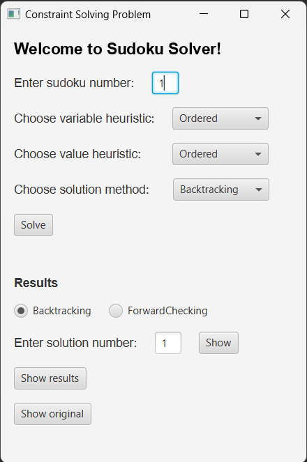

<a name="top"></a>

# Sudoku Solver

<details>
  <summary>Table of Contents</summary>
  <ol>
    <li>
      <a href="#about-the-project">About The Project</a>
      <ul>
        <li><a href="#built-with">Built With</a></li>
      </ul>
    </li>
    <li>
      <a href="#getting-started">Getting Started</a>
      <ul>
        <li><a href="#prerequisites">Prerequisites</a></li>
        <li><a href="#installation">Installation</a></li>
        <li><a href="#run">Run</a></li>
      </ul>
    </li>
    <li>
      <a href="#usage">Usage</a>
      <ul>
        <li><a href="#input-data">Input data</a></li>
          <li><a href="#results">Results</a></li>
            <ul>
              <li><a href="#result-info">Result info</a></li>
            </ul>
          <li><a href="#demo">Demo</a></li>
      </ul>
    </li>
  </ol>
</details>


## About The Project

This project contains the implementation of two solution approaches to the <a href="https://en.wikipedia.org/wiki/Constraint_satisfaction_problem">Constraint Satisfacion Problem</a>: <a href="https://en.wikipedia.org/wiki/Backtracking">Backtracking</a> and <a href="https://en.wikipedia.org/wiki/Look-ahead_(backtracking)#Look_ahead_techniques">Forward Checking</a>. The CSP in question is modelled based on Sudoku. It was originally created for a laboratory class as part of _Artificial Intelligence_ course at _Wrocław University of Science and Technology_. Therefore it includes a way to save the result data for further analysis.

_For examples of use, please refer to the <a href="#usage">Usage</a> section._

### Built With


<p align="right">(<a href="#top">back to top</a>)</p>


## Getting Started

To get a copy of this project running on your machine follow these steps.

### Prerequisites

* Java Development Kit (JDK) installed
* IDE configured for development of Java applications _(I used Eclipse, other IDEs may require additional configuration steps to run the project)_

### Installation

1. Clone this repository:

   ```bash
   git clone https://github.com/macSro/Sudoku-Solver.git
   ```

2. Open the project in Eclipse _(or other IDE, see Prerequisites)_

3. Setup JavaFX _(for Eclipse)_

    1. Download <a href="https://gluonhq.com/products/javafx/">JavaFX</a> _(this project was created with JavaFX 14)_

    2. Unzip the contents to a location of choice

    3. Navigate to: Window > Prefereces > Java > Build Path > User Libraries

    4. Click "New" and enter the name _(e.g. JavaFX14)_

    5. Select the new library, click on Add External JARs

    6. Select all *.jar files and src.zip in ```path\to\javafx\lib```

    7. Right click on project and select Properties
    
    8. Navigate to Java Build Path > Libraries > Classpath

    9. Click on "Add Library", then "User Library" and finally select the name of JavaFX library created above.

    10. Navigate to Run > Run configurations > Arguments

    11. In "VM Arguments" paste the following:

    ```
    --module-path path\to\javafx\lib --add-modules=javafx.controls
    ```

    _* remember to input the actual path_


### Run

The simplest way to run the application is with the IDE's Run button or a keyboard shortcut _(Eclipse: Ctrl+F11)_.

<p align="right">(<a href="#top">back to top</a>)</p>


## Usage

The application offers the following GUI:

<div align="center">
  
</div>

* Sudoku number: _1-46 (see: <a href="#input-data">Input data</a>)_

* Variable heuristic: _Ordered / Most constrained_

* Value heuristic: _Ordered / Random_

* Value heuristic: _Backtracking / Forward checking_

* Solution number: _Difficult Sudokus may sometimes be solved in more then 1 way_

* Results: _Check execution details (see: <a href="#result-info">Result info</a>)_

* Original: _Check the original (unsolved) Sudoku in a human-readable form (zeros represent empty cells):_

<div align="center">
  
</div>

### Input data

```data/Sudoku.csv``` contains 46 Sudokus (1-5 include solutions for reference) varying in difficulty (1 = easiest, 9 = hardest). Empty cells are represented by a "." symbol. If you'd like to provide your own Sudoku to solve, either replace one of the rows with your Sudoku in the same format, or modify the code to your needs :)

<div align="center">
  
</div>

### Results

Similarly to the "original", solved Sudokus are available in a human-readable form. You can access result files via GUI or manually in ```results/board<id>_solution<idOfSolution>_<solutionMethod>```. Here's an example:

<div align="center">
  
</div>

#### Result info

After a Sudoku is solved additional execution details can be found in ```results/board<id>_resultInfo_<solutionMethod>.txt```. Here you can find the number of solutions found in order to check all of them via GUI.

<div align="center">
  
</div>

### Demo

https://github.com/macSro/Sudoku-Solver/assets/56345054/b831d45b-9247-4798-9c0d-519cacf0cad6

<p align="right">(<a href="#top">back to top</a>)</p>
